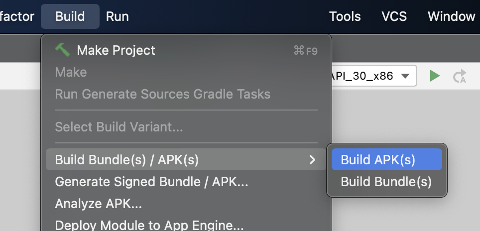

# [Reminders](https://fullchee-reminders.netlify.app/)

[](https://app.netlify.com/sites/fullchee-reminders/deploys)

- Shows a random piece of media that reminded me of who I want to be.
- In the day-to-day grind, it's easy to forget what's important.
- I've also started using this as a spaced repetition tool (like Anki) for YouTube and podcasts.
- I visit this site often to remind myself of what kind of person I want to be from moma's womb to tomb.
- I also use this as an alternative to getting sucked into YouTube or another social media site or the news.
- [a breakable toy](https://www.reactiflux.com/transcripts/jared-palmer-2#how-would-you-recommend-a-student)

## Links

- Frontend React App
  - [Website](https://fullchee-reminders.netlify.app/)
  - [GitHub](https://github.com/Fullchee/values-client)
- Backend
  - [GitHub](https://github.com/Fullchee/reminders-backend)
  - Postgres, Node, Express

---

## Install

1. Install node version 14+
2. Install `yarn v1`
3. Install npm dependencies
   1. `yarn`
4. Setup local env variables
   1. `cp sample.env .env`
   2. Update the env var

```bash
yarn
yarn start
```

## Deploy

- Netlify is linked with the GitHub repo

## Building the Android APK

1. Ensure that Android Studio is installed
   1. `brew install --cask android-studio`
2. Ensure that ionic is installed
   1. `npm i -g @ionic/cli`
3. `yarn android`
4. In the menu bar, click `Build > Build Bundle(s) / APK
5. 
6. Save the `app-debug.apk`

## Kanban board

- [Trello](https://trello.com/b/DG63L6yU/reminders)

## Dependencies

- @capacitor
  - to build the android app
- react v18
- react query v5
  - async state management
  - dev tools is a dependency because it's an actual component that gets stripped on prod
- react-router-dom v6
- tinymce v4
  - text editor
- vite v5
  - needed to build, Netlify doesn't install dev dependencies in the build

### Dependencies that can be removed

- framer motion

---

## React + TypeScript + Vite

This template provides a minimal setup to get React working in Vite with HMR and some ESLint rules.

Currently, two official plugins are available:

- [@vitejs/plugin-react](https://github.com/vitejs/vite-plugin-react/blob/main/packages/plugin-react/README.md) uses [Babel](https://babeljs.io/) for Fast Refresh
- [@vitejs/plugin-react-swc](https://github.com/vitejs/vite-plugin-react-swc) uses [SWC](https://swc.rs/) for Fast Refresh

### Expanding the ESLint configuration

If you are developing a production application, we recommend updating the configuration to enable type aware lint rules:

- Configure the top-level `parserOptions` property like this:

```js
export default {
  // other rules...
  parserOptions: {
    ecmaVersion: "latest",
    sourceType: "module",
    project: ["./tsconfig.json", "./tsconfig.node.json"],
    tsconfigRootDir: __dirname,
  },
};
```

- Replace `plugin:@typescript-eslint/recommended` to `plugin:@typescript-eslint/recommended-type-checked` or `plugin:@typescript-eslint/strict-type-checked`
- Optionally add `plugin:@typescript-eslint/stylistic-type-checked`
- Install [eslint-plugin-react](https://github.com/jsx-eslint/eslint-plugin-react) and add `plugin:react/recommended` & `plugin:react/jsx-runtime` to the `extends` list
